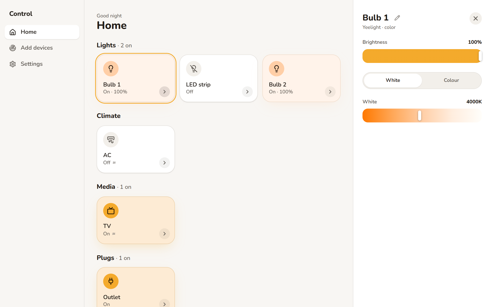
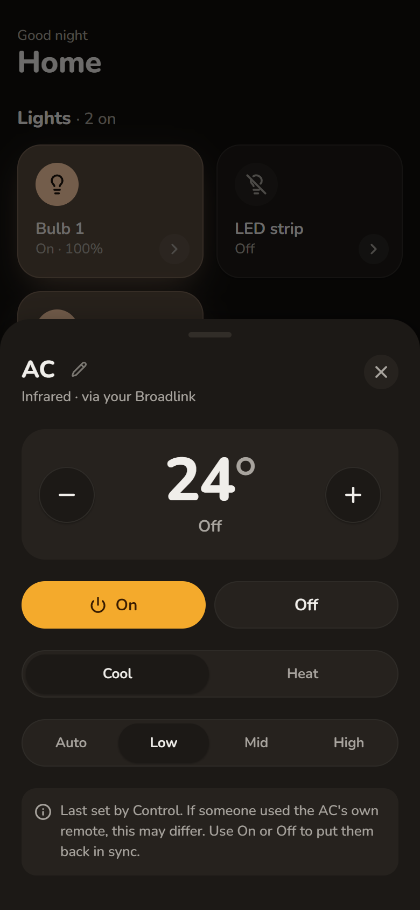

<div align="center">


# Control

**Every smart device in your home, in one app.**

Control scans your Wi-Fi, finds your lights, plugs, TV boxes and remotes, and puts them on one screen.
Everything stays on your home network, and you can delete the app for each brand.

[](https://github.com/oBecks/control/actions/workflows/check.yml)

</div>

<p align="center">
  
  &nbsp;
  
</p>
<p align="center">
  
  &nbsp;
  
</p>

Tiles take on each device's real colour when it's on. Tap one to switch it, or open its controls. An AC or TV behind an infrared hub shows ≈, because Control only knows what it last sent.

Put devices together in a **Group** ("Living room lights") and they get one Tile at the top of Home. A tap switches them all, and its controls offer what every device in it can do: brightness and colour for a group of lights, mode and temperature for a group of ACs, on and off for anything else.

## What it controls

| | |
|---|---|
| **Yeelight** | Bulbs and LED strips |
| **Tuya / Smart Life** | Wi-Fi plugs |
| **Broadlink RM** | Infrared hubs, and through them your AC, TV, fan or anything else with a remote |
| **Android TV / Google TV** | Streaming boxes (NVIDIA Shield, Chromecast with Google TV, operator boxes like yes+) and TVs running Android TV |

An Android TV box becomes a **Streamer**: link it once with the code it shows on the TV, and Control turns it on and off, changes the volume, works its arrow pad, and opens your apps with one tap. Its Tile shows which app is open. Turn on the box's developer mode and Control can also list the apps really installed and open any of them, even ones like yes+ that can't be opened otherwise.

Your AC doesn't need to be smart. With a Broadlink hub, Control finds the right remote codes for your AC by testing a few models at once. For a TV or fan, press each button on the old remote once and Control learns it.

## Install

Download `ControlSetup.exe` from the [latest release](https://github.com/oBecks/control/releases/latest) and run it. No admin rights needed.

Control isn't signed yet, so Windows may say "Windows protected your PC". Click **More info**, then **Run anyway**.

Control opens in its own window and keeps running in the tray when you close it, so your phone keeps working. It starts with Windows (switch that off in Settings). To quit, right-click the tray icon and choose **Quit Control**.

Go to **Add devices** and hit **Scan**. That's it.

## Run from source

You need Windows, Python 3.11+ and Node.js 24.

```bash
git clone https://github.com/oBecks/control.git && cd control
python -m venv .venv && .venv/Scripts/pip install -e ".[desktop]"
npm --prefix web install && npm --prefix web run build
.venv/Scripts/python -m control.desktop
```

Or run just the Engine with `.venv/Scripts/control serve` and open http://localhost:8321.

## On your phone

Turn on **Settings → Phone access**, scan the QR code with your phone, and approve the code it shows. On iPhone, add it to the Home Screen first and it runs like a real app.

It works anywhere on your home Wi-Fi, as long as the PC is on.

## Ask Claude (the MCP server)

Open **Settings → Assistant** and click **Connect Claude**, then quit and reopen Claude Desktop. Now you can ask it to "dim the living room lights", "set the AC to 23", "put yes+ on the Shield" or "make a group of the bedroom lights". Claude asks before it changes anything.

For Claude Code, run the command shown in **Settings → Assistant** once:

```cmd
claude mcp add --scope user control -- "%LOCALAPPDATA%\Programs\Control\Control.exe" --mcp
```

Any other MCP client can start the same local server: `Control.exe --mcp` (stdio). If Control isn't running, the server starts it in the tray. Nothing leaves your home network.

### Tools

| Tool | What it does |
|---|---|
| `list_devices` | Every Device and Group, optionally with its current state |
| `get_device` | One Device's or Group's state and what can be set on it; for TVs, fans and Streamers also their buttons, and for Streamers the open app, volume and apps |
| `set_power` | Turn a Device, a Streamer or a whole Group on or off |
| `set_light` | Brightness, colour or white temperature of a light or a Group of lights |
| `set_climate` | AC mode, temperature, fan and swing, for one AC or a Group of ACs |
| `press_button` | Press a button on an infrared remote or a Streamer ("Volume +", "Home", "HDMI 1") |
| `open_app` | Open an app on a Streamer ("Netflix", "yes+") |
| `create_group` | Make a Group from Devices (marked as made by the Assistant) |
| `edit_group` | Rename a Group, or add and remove Devices |
| `delete_group` | Delete a Group; its Devices stay |

Devices are named by their name in Control (any case, or a unique part of it) or their uid. Setting things up (scanning, linking, adding devices, renaming, editing a Streamer's apps) stays in the Control app.

Claude is honest about what Control can't know: an AC or TV behind an infrared hub is reported as what Control last sent, and a remote with only a Power button as "unknown".

**After updating Control, restart Claude.** Claude keeps the old server running until it restarts, so new tools only appear after that.

It works in Claude on the PC running Control, not on claude.ai, the Claude phone app or cloud sessions: those can't reach your home network.

## Coming next

- **Hotkeys**, **Dashboards** you arrange yourself, **Automations** the app runs on its own, then **Scenes**. *Planned, in that order.*
- Samsung TVs, Google Cast, and one device for a TV box plus the TV behind it. *Later.*
- Rooms, more brands and Bluetooth. *Later.*

## Good to know

The Tuya plug is the only device that needs a one-time sign-in, to fetch its key. Control is a personal project in its early days. The [roadmap](docs/roadmap.md) lists what's missing.

Want to dig in? Start with the [glossary](CONTEXT.md), the [design decisions](docs/adr/) and the [design system](docs/design-system.md).
