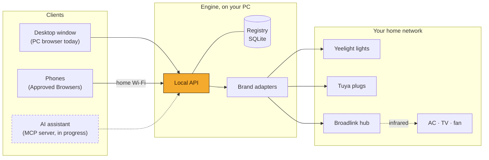

<div align="center">


# Control

**One place for every smart device in your home.**

Control scans your Wi-Fi, finds your lights, plugs and infrared remotes, and puts them on one screen that sorts itself.
It runs on your Windows PC and talks to your devices directly over your home network.

[](https://github.com/oBecks/control/actions/workflows/check.yml)

</div>

---

## Why Control

Most homes end up with one app per brand. The lights live in one app, the plug in another, and the AC only answers to a remote that's always lost. Control replaces all of them with a single app:

- **It finds devices on its own.** A Scan lists everything it recognises on your network. You don't type IP addresses or pair anything by hand.
- **It stays local.** Control talks to each device over your home network. It contacts a brand's cloud only once, when the brand keeps a device's key there. Today that's Tuya.
- **It organises itself.** Home groups your devices by kind, such as Lights, Climate and Plugs. Each Tile takes the real colour of what it controls, so a lit bulb shows its actual colour and a cooling AC shows blue.
- **It reaches the dumb appliances too.** With an infrared hub, your AC, TV and fan get the same Tiles as your smart bulbs.

## Supported devices

| Brand | Devices | How Control reaches them | What you do once |
|---|---|---|---|
| **Yeelight** | Bulbs, LED strips | Yeelight's local network protocol | Turn on *LAN Control* for each light in the Yeelight app |
| **Tuya / Smart Life** | Wi-Fi plugs | Tuya's local protocol, with the device's Local Key | Link your Smart Life account once by scanning a QR code |
| **Broadlink RM** | Infrared hubs such as the RM mini 3 | Broadlink's local protocol | Unlock the hub in the Broadlink app if Control says it's locked |

Through a Broadlink hub, Control also controls appliances that have no network connection of their own:

| Appliance | How Control gets its remote's signals |
|---|---|
| **Air conditioners** | From a community library of AC remotes. The Code Set Finder tests several models at once, so you learn which one is yours from the temperature your AC shows. |
| **TVs** | From the same library, or by Learning: point the TV's remote at the hub and press each button. |
| **Fans** | From the library, or by Learning. |
| **Anything else with an IR remote** | Learning. |

The signal library comes from the [SmartIR](https://github.com/smartHomeHub/SmartIR) project.

> More brands, Bluetooth devices and hubs such as Philips Hue are planned. See [What's next](#whats-next).

## How it works



Control has two parts.

**The Engine** is a Python program that runs on your PC. It scans the network, remembers every device, and does all the talking to them. Each brand has its own adapter, built on the same open-source libraries Home Assistant uses. The Engine keeps what it learns in a small database in `%LOCALAPPDATA%\Control`: device names, the codes that control each AC, the buttons you taught it and the keys from a Link. Nothing about your home goes into this repository.

**Clients** are the screens you use: the web app in a browser on your PC, the same app on your phone, and later an AI assistant. Clients hold no device logic. They only call the Engine's local API, so your phone and your PC always show the same devices in the same state.

### From Scan to Tile

1. **Scan.** Control listens on your network for each supported brand and lists what it found.
2. **Readiness.** Control sorts each Found Device into one of four groups.
   - *Ready* devices can be controlled right away.
   - *Needs Link* devices need one step that Control walks you through, like the Smart Life QR sign-in.
   - *Needs Setup* devices need a change in the brand's own app first, like unlocking a Broadlink hub.
   - *Unsupported* devices are smart, but Control can't control their brand or model yet.
3. **Home.** Ready devices appear as Tiles, grouped by kind. Tap a Tile to switch it on or off, or open its controls for brightness, colour, AC mode and temperature.

A device keeps its name and settings when its IP address changes. If it stops answering, its Tile shows *Offline* until a Scan finds it again.

### Remote Devices and Assumed State

An AC or TV can't tell anyone whether it's on. Control remembers what it last sent and shows that as an **Assumed State**, marked with ≈ on the Tile, because someone may have used the physical remote since. A remote with one button for both on and off, called a Power Toggle, never gets an assumed on/off state. Control sends Power and doesn't guess the result.

## Using Control

### On your PC

Start the Engine and open **http://localhost:8321**. The PC running Control is always trusted, so it needs no sign-in.

### On your phone

1. On the PC, turn on **Settings → Phone access**. Control shows its address on your network and a QR code.
2. Open that address on a phone connected to the same Wi-Fi.
3. The phone shows a six-digit code. The PC shows a banner with the same code. Check they match and click **Approve**.

The phone stays approved until you revoke it in Settings. There's no password to share. An approved phone can also approve the next one.

| | |
|---|---|
| **iPhone** | Add Control to the Home Screen first with Share → Add to Home Screen, then approve it from the new icon. It opens full screen, like a separate app. |
| **Android** | Chrome's *Add to Home screen* gives Control an icon, which opens in a Chrome tab. A full install needs HTTPS, which Control doesn't offer on the home network yet. |

Phones only work while the PC running Control is on and you're on the home Wi-Fi. Control has no remote access by design.

## Getting started

Control currently runs from source. A one-click Windows installer is part of the desktop app, which is [in progress](#whats-next).

You need Windows 10 or 11, Python 3.11 or newer and Node.js 24.

```bash
git clone https://github.com/oBecks/control.git
cd control

# Engine
python -m venv .venv
.venv/Scripts/pip install -e ".[dev]"

# Web app
npm --prefix web install
npm --prefix web run build

# Run
.venv/Scripts/control serve
```

Then open http://localhost:8321, go to **Add devices** and run a Scan.

The first time you turn on Phone access, Windows asks whether to let Python on the network. Allow **Private networks**. If Windows treats your home network as Public, Settings tells you, because the firewall then blocks phones.

### Command line

The Engine has a CLI for scripting and troubleshooting. `control --help` lists everything.

```bash
control scan                       # scan and remember what's found
control devices                    # list remembered devices
control light "Desk lamp" on       # control a light
control plug Outlet off            # control a plug
control ac-codes electra           # search the AC library by brand
control ac AC set --mode cool --temp 23
control tuya-link                  # link Smart Life to fetch Local Keys
```

## What's next

| | Status |
|---|---|
| **Desktop app.** Control starts with Windows, sits in the tray and opens in its own window. One installer, no terminal. | In progress |
| **Scenes.** One tap sets several devices at once, e.g. "Movie night". | In progress |
| **MCP server.** Lets an AI assistant read and control your devices through the Engine. | In progress |
| **Rooms.** Group devices by where they are, alongside grouping by kind. | Planned |
| **Hubs & Bridges.** A Settings page for hubs and the devices that depend on them. | Planned |
| **More brands.** Bridges such as Philips Hue, and Bluetooth devices. | Planned |
| **Automations.** Schedules and triggers. | Planned |

The detailed plan lives in [docs/roadmap.md](docs/roadmap.md).

## Security and privacy

- **Control works on your home network only.** Device control never goes through a brand's cloud.
- **Phone access is off by default.** When it's on, every browser other than the PC itself must be approved. The Engine stores only a hash of each phone's token, and it refuses requests sent by other websites.
- **Phone access uses plain HTTP on your home network.** Someone who can capture your Wi-Fi traffic could copy a phone's token. [ADR 0003](docs/adr/0003-phone-access-approved-browsers-over-lan-http.md) explains the trade-off.
- **Known gaps before a public release.** Tuya Local Keys are stored unencrypted for now. The Tuya Link signs in using Home Assistant's registered app identity, which is fine for personal use but has to change before Control ships to others. [ADR 0002](docs/adr/0002-tuya-link-borrows-home-assistant-identity.md) has the details.

Every command Control sends reaches real devices in your home. Switching a plug cuts power to whatever is plugged into it.

## Design

Control's interface follows a written [design system](docs/design-system.md). It aims to be calm and minimal, so your devices' own colours carry the screen. The one accent colour is a warm amber, kept apart from the AC's cool blue. Light and dark themes are both first-class, and phone and desktop layouts are designed as equals: Device Controls open as a bottom sheet on phones and a side panel on desktop.

The running app includes a living style guide at `/styleguide` that shows every Tile state in both themes.

## For contributors

| Path | What's there |
|---|---|
| `src/control/engine/` | Scanners, the Registry, brand adapters, the Signal Library and the Code Set Finder |
| `src/control/api/` | The FastAPI app every Client uses, plus Phone access |
| `web/` | The SvelteKit web app |
| `tests/` | Engine and API tests |

Before changing anything, read these:

- **[CONTEXT.md](CONTEXT.md)**, the glossary. Code, UI text and docs all use its terms, such as Device, Hub, Remote Device, Code Set, Link and Tile.
- **[docs/adr/](docs/adr/)**, the architecture decisions and why they were made.
- **[docs/design-system.md](docs/design-system.md)**, before any UI change.

For UI work with hot reload, run the Engine and `npm --prefix web run dev`, then open http://localhost:5173. The dev server forwards `/api` to the Engine. A change is done when both checks pass:

```bash
.venv/Scripts/python -m pytest -q
npm --prefix web run check
```

GitHub Actions runs the same checks on every push and pull request.
