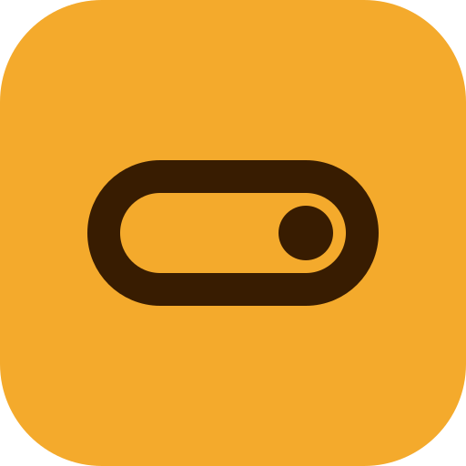
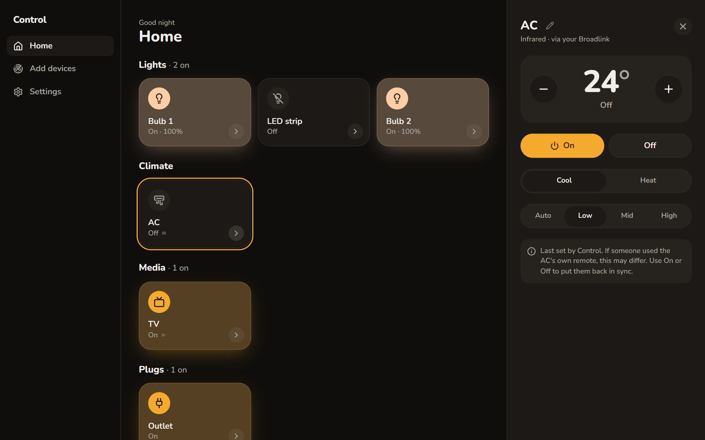
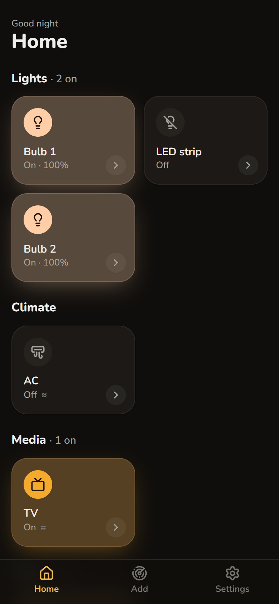

<div align="center">



# Control

**Every smart device in your home, in one app.**

Scan your Wi-Fi, and your lights, plugs, AC and TV boxes show up on one screen.
Everything stays on your home network.

[](https://github.com/oBecks/control/actions/workflows/check.yml)

</div>

<p align="center">
  
  &nbsp;
  
</p>

## What you can do

- Tap a Tile to switch a device. It glows in the light's real colour.
- Dim lights, change colours, set the AC.
- Control a TV or fan that has no Wi-Fi, through an infrared hub.
- Open Netflix or yes+ on your TV box with one tap.
- Group devices ("Living room lights") and switch them together.
- Use it from your phone, or just ask Claude.

## Works with

| Brand | Devices |
|---|---|
| Yeelight | Bulbs and LED strips |
| Tuya / Smart Life | Wi-Fi plugs |
| Broadlink RM | Infrared hubs, and through them any AC, TV or fan with a remote |
| Android TV / Google TV | NVIDIA Shield, Chromecast with Google TV, yes+ boxes, Android TVs |

Your AC doesn't need to be smart. Control tries a few remote codes and you tell it which one the AC answered.

## Get started

1. Download `ControlSetup.exe` from the [latest release](https://github.com/oBecks/control/releases/latest) and run it. No admin rights needed.
2. If Windows says "Windows protected your PC", click **More info**, then **Run anyway**. Control isn't signed yet.
3. Go to **Add devices** and press **Scan**.

Control keeps running in the tray after you close its window, so your phone keeps working. Quit it from the tray icon.

## On your phone

Turn on **Settings → Phone access**, scan the QR code, and approve the code your phone shows. Works anywhere on your home Wi-Fi while the PC is on. On an iPhone, add it to the Home Screen and it opens like an app.

## Ask Claude

In **Settings → Assistant**, click **Connect Claude**, then restart Claude Desktop. Now try "dim the living room lights" or "put yes+ on the Shield". Claude asks before it changes anything.

For Claude Code, or any other MCP client, run the local server `Control.exe --mcp`. Settings shows the exact command. Restart Claude after you update Control, or it keeps the old tools.

| Tool | What it does |
|---|---|
| `list_devices` | Lists your devices and Groups |
| `get_device` | Reads one device's state and what you can change |
| `set_power` | Turns a device or Group on or off |
| `set_light` | Sets brightness or colour |
| `set_climate` | Sets the AC's mode, temperature and fan |
| `press_button` | Presses a remote button, like Volume + |
| `open_app` | Opens an app on a TV box |
| `create_group` | Makes a Group |
| `edit_group` | Renames a Group or changes its devices |
| `delete_group` | Deletes a Group |

It only works in Claude on the same PC. Claude on the web or your phone can't reach your home network.

## Coming next

Hotkeys, then Dashboards, Automations and Scenes. Later, Samsung TVs, Rooms and more brands. See the [roadmap](docs/roadmap.md).

<details>
<summary>Run from source</summary>

You need Windows, Python 3.11+ and Node.js 24.

```bash
git clone https://github.com/oBecks/control.git && cd control
python -m venv .venv && .venv/Scripts/pip install -e ".[desktop]"
npm --prefix web install && npm --prefix web run build
.venv/Scripts/python -m control.desktop
```

The [glossary](CONTEXT.md), [design decisions](docs/adr/) and [design system](docs/design-system.md) explain how it's built.

</details>
